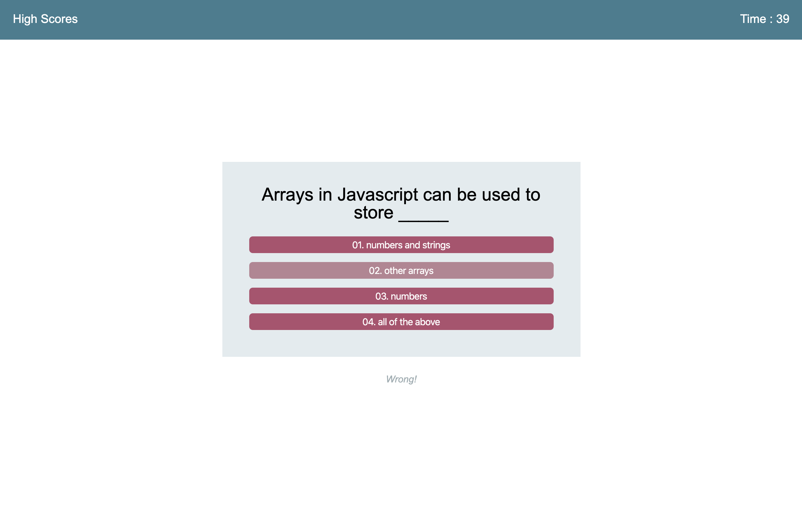

# JavaScript-Quiz

This is a timed multiple-choice quiz on basic JavaScript knowledge

When the user begins the quiz, they are given 60 seconds to answer all of the questions. 

If the user answers a question right, they are informed that their answer was right.

If the user answers a question wrong, they are informed that their answer was wrong and
10 seconds are deducted from their remaining time. 

When the user has finished all of the questions, or the time has run out, they are 
shown their final score. 

They are asked to submit their initials, and their quiz results will be added to a 
high-score list. 

They can then choose to view the high-score list or to return to the main menu and try
the quiz again. 
